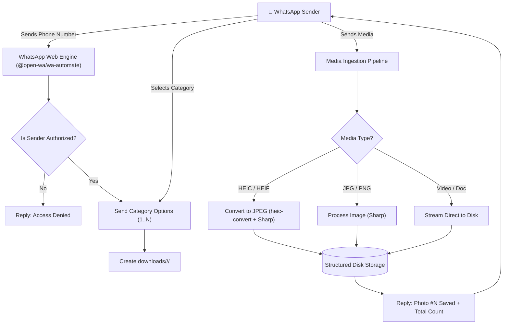

<p align="center">
  
</p>

<h1 align="center">WhatsApp Photo Manager</h1>

<p align="center">
  <strong>Production-grade WhatsApp bot and Windows desktop service for automated photo organization, batch media processing, and categorized storage.</strong>
</p>

<p align="center">
  
  
  
  
  
</p>

---

## Overview

**WhatsApp Photo Manager** provides an automated bridge between WhatsApp and your local file storage. Incoming photos, videos, and documents sent by authorized contacts are categorized, validated, standardized, and saved into structured directories in real time.

It can be deployed either as a **standalone Windows background tray application** (with no runtime dependencies required) or run directly in **headless developer mode** on any Node.js environment.

---

## Key Highlights

- 🔒 **Contact Authorization Whitelist**: Restrict bot usage strictly to verified client and staff phone numbers.
- 🗂️ **Automated Folder Categorization**: Automatically structures media into `downloads/<Category>/<PhoneNumber>/`.
- 🖼️ **On-the-Fly Image Standardization**: Auto-converts HEIC/HEIF images from iOS devices to JPG; standardizes color profiles and dimensions using Sharp.
- 🖥️ **Native Windows System Tray Interface**:
  - Starts silently in the background without intrusive terminal popups.
  - Interactive "Link WhatsApp" modal displaying QR codes with auto-refresh and automatic dismissal upon authentication.
  - Dark-mode diagnostics console with real-time process monitoring and log archiving.
  - Built-in GUI Settings dialog for folder picking and contact management without touching code.
- 📦 **Zero-Dependency Installer**: Bundles standalone Node.js and Google Chrome into an Inno Setup installer (~246 MB).
- 🧪 **Enterprise Test Suite**: Built-in unit and integration test coverage across configuration, security sanitizers, and binary integrity.

---

## System Architecture



---

## Quickstart Guide

### Option 1: Standalone Windows App (Recommended for Users)

1. Download or compile the installer:
   ```text
   installer/WhatsAppPhotoManager-Installer-1.0.0-x64.exe
   ```
2. Run the installer and follow the setup wizard.
3. Launch **WhatsApp Photo Manager** from the Start Menu or Desktop.
4. The app launches quietly in your **System Tray** (near the Windows clock):
   - When first launched, the **"Link WhatsApp"** dialog opens automatically.
   - Scan the QR code using WhatsApp on your phone (**Linked Devices** > **Link a Device**).
   - Once connected, the window automatically closes and the bot is live.
5. Right-click the system tray icon anytime to open **Settings**, view **Live Logs**, or open your **Downloads Folder**.

---

### Option 2: Developer & Server Setup (Node.js)

#### Prerequisites
- **Node.js**: `v18.0.0` or higher
- **npm**: `v9.0.0` or higher
- **Git**

#### Installation

```bash
# 1. Clone the repository
git clone https://github.com/alphaseneca/wa-photo-manager.git
cd wa-photo-manager

# 2. Install dependencies (automatically runs postinstall compatibility patch)
npm ci

# 3. Compile TypeScript
npm run build

# 4. Run automated test suite
npm test
```

#### Running the Service

```bash
# Start in production mode
npm start

# Or start in development mode with live reload
npm run dev
```

On first launch, scan the QR code displayed in the console or open `qr_code_photo-manager-session.png` generated in the root directory.

---

## Usage Workflow

The bot guides authorized users through a structured 3-step conversation:

```text
Step 1: Contact sends phone number identifier
   Example: 1234567890

Step 2: Bot presents configured category choices:
   📂 Select Photo Category
   1️⃣ Photo Category 1
   2️⃣ Photo Category 2
   3️⃣ Photo Category 3
   4️⃣ Photo Category 4

Step 3: Contact replies with choice (e.g., '1')
   Bot creates destination folder and confirms readiness.

Step 4: Contact sends photos, videos, or documents
   Media is saved with sequential numbering and instant counter confirmations.
```

### Generated Directory Layout

```text
downloads/
├── Photo Category 1/
│   ├── 1234567890/
│   │   ├── 1715234567890.jpg  (Photo #1)
│   │   ├── 1715234567891.jpg  (Photo #2)
│   │   └── 1715234567892.jpg  (Photo #3)
│   └── 9876543210/
│       └── 1715234567900.jpg
├── Photo Category 2/
│   └── 1234567890/
├── Photo Category 3/
└── Photo Category 4/
```

---

## Configuration Reference

Settings can be managed either graphically via the **Tray Settings Dialog** (which persists to `config.json`) or directly by editing [`config.js`](config.js).

### Configuration Schema

| Setting Key | Type | Default | Description |
| :--- | :--- | :--- | :--- |
| `ALLOWED_NUMBERS` | `string[]` | `[]` *(Allow all)* | Whitelisted phone numbers / sender IDs. Numbers must contain only digits. |
| `PHOTO_CATEGORIES` | `string[]` | `['Photo Category 1', ...]` | Registered categories. Each corresponds to an auto-created storage directory. |
| `FOLDER_SETTINGS.downloadsDir` | `string` | `"downloads"` | Root storage directory on disk (relative or absolute path). |
| `FOLDER_SETTINGS.maxFileSize` | `number` | `52428800` *(50MB)* | Maximum allowed file size per media upload in bytes. |
| `BOT_CONFIG.sessionId` | `string` | `"photo-manager-session"` | Unique session name used for browser storage and QR pairing. |
| `BOT_CONFIG.headless` | `boolean` | `true` | Runs Chromium headless in the background without opening a browser window. |
| `BOT_CONFIG.multiDevice` | `boolean` | `true` | Enables WhatsApp Multi-Device protocol support. |
| `BOT_CONFIG.authTimeout` | `number` | `120` | QR scan timeout in seconds before regenerating a new code. |

### `config.json` Override Format

When running as an installed desktop app, settings are saved cleanly to `config.json` without modifying code files:

```json
{
  "ALLOWED_NUMBERS": [
    "1234567890",
    "9779800000000"
  ],
  "PHOTO_CATEGORIES": [
    "Photo Category 1",
    "Photo Category 2",
    "Photo Category 3",
    "Photo Category 4"
  ],
  "FOLDER_SETTINGS": {
    "downloadsDir": "C:\\Users\\User\\Pictures\\WhatsAppPhotos"
  },
  "BOT_CONFIG": {
    "sessionId": "photo-manager-session",
    "headless": true,
    "multiDevice": true
  }
}
```

---

## Automated Testing & Quality Assurance

The codebase includes an automated regression test suite using Node.js's native test runner (`node:test`):

```bash
# Execute full test suite
npm test
```

### Test Suites Covered:
- **Configuration Module Suite**: Validates config parsing, generic category conventions, bot parameters, and message formats.
- **Sanitizer & Security Suite**: Tests international phone number parsing, strict character whitelisting, directory traversal protections, and allowed media extensions.
- **Build & Packaging Integrity Suite**: Verifies binary signatures for PNG/ICO assets, Inno Setup parameterization, and launcher compilation prerequisites.

---

## Desktop Packaging & Distribution

To build the standalone Windows application package and single-file setup installer:

```powershell
# 1. Compile TypeScript, bundle dependencies, and compile C# launcher
npm run package

# 2. Build Inno Setup Installer executable
& "C:\Program Files (x86)\Inno Setup 6\ISCC.exe" scripts\installer.iss
```

The resulting installer is output to:
```text
installer/WhatsAppPhotoManager-Installer-1.0.0-x64.exe
```

---

## CI / CD Pipelines

The repository includes pre-configured GitHub Actions workflows in [`.github/workflows/`](.github/workflows/):

- **Continuous Integration (`ci.yml`)**: Automatically triggers on all pushes and pull requests across Ubuntu and Windows environments with Node.js 18, 20, and 22. Runs TypeScript builds and automated test suites.
- **Automated Release (`release.yml`)**: Triggers on version tag pushes (`v*.*.*`). Assembles the standalone package on Windows, compiles the Inno Setup installer, and publishes a new GitHub Release with attached binaries.

---

## Project Structure

```text
wa-photo-manager/
├── .github/
│   └── workflows/
│       ├── ci.yml              # Multi-OS test & build verification
│       └── release.yml         # Tag-triggered Windows installer release
├── assets/
│   ├── app-logo.png            # High-resolution application brand logo
│   └── app-logo.ico            # Multi-frame Windows icon (16px to 256px)
├── scripts/
│   ├── Launcher.cs             # Native C# Windows tray launcher & GUI dialogs
│   ├── build-package.ps1       # Packaging automation script
│   ├── installer.iss           # Inno Setup 6 compilation script
│   ├── png-to-ico.js           # Multi-resolution ICO generator
│   └── postinstall.js          # Puppeteer & User-Agent compatibility patch
├── src/
│   ├── index.ts                # Application lifecycle & WhatsApp event loop
│   └── ...
├── tests/
│   ├── build-integrity.test.js # Asset & packaging integrity tests
│   ├── config.test.js          # Config schema & validation tests
│   └── sanitizer.test.js       # Security & phone sanitization tests
├── config.js                   # Active configuration & message dictionary
├── config.template.js          # Clean configuration template
├── package.json
└── tsconfig.json
```

---

## License

This project is licensed under the **MIT License**. See the [LICENSE](LICENSE) file for details.